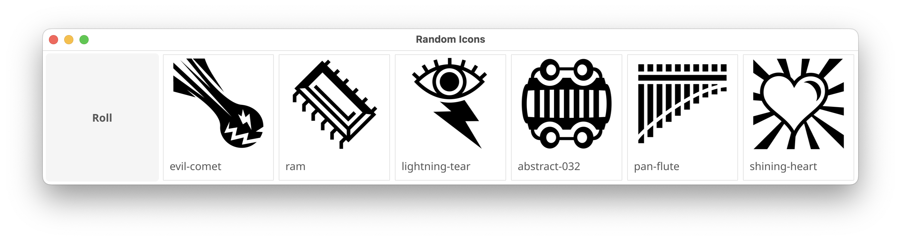

# random-icons
Simple gui app for randomly showing a bunch of icons, with bare minimum features/MVP.

Originally made as local version of [zero_dice](https://tangent-zero.com/zero_dice/zero_dice.htm), using [game-icons](https://game-icons.net/) or other png images.  

## How to use
- `go run src ./`
  - module under the subdirectory of git repository can't be used currently, so you can't simply do `go install github.com/romanthekat/homebrew/random-icons@latest`
- put png icons in `./icons` directory (can have subdirectories)
- or in terminal `random-icons PATH_TO_FOLDER_WITH_ICONS`

## TODO Extra features
- customizable amount of icons to generate
- tags/subtags for images, generation based on selected tags